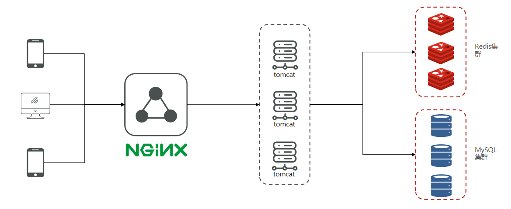

## 🍭“小众点评”项目🍕

## 项目简介

本项目旨在模仿目前常用的“大众点评”APP，提供了一个可以查看商铺，关注博主，查看博文，下单点餐的综合性应用。
亮点：本项目深度整合Redis的各种应用，包括使用Redis解决Session共享问题，使用Redis作为缓存的应用，使用Redis实现分布式锁，使用Redis的Set和Zset实现点赞，共同好友和排行榜和动态Feed流等功能，使用GEO数据类型实现附近商铺功能等。

项目笔记：https://blog.csdn.net/lyx7762/article/details/128077616

## 项目特色

* 使用Redis解决分布式系统下Session共享问题
* 使用Redis作为缓存并解决相关问题
  * 使用缓存空对象和布隆过滤解决缓存穿透问题
  * 使用Redis集群配合随机TTL解决缓存雪崩问题
  * 使用互斥锁和逻辑过期方法解决缓存击穿问题
* 代金券秒杀业务 （优化迭代三次）
  * 基于乐观锁和悲观锁实现秒杀业务
  * 基于Redis和Lua脚本实现了分布式可重入锁解决秒杀业务
  * 使用Redisson分布式锁解决秒杀业务
  * 利用Lua脚本+Redisson+Stream消息队列实现异步下单，进一步提高业务的吞吐量。
* 基于Redis Set和Sorted Set
  * 实现好友关注，取关和查找共同关注的功能
  * 实现用户点赞以及点赞排行榜功能
  * 实现基于推模式的用户动态Feed流
* 基于Redis GEO实现附近商铺功能

## 项目架构和技术选型

* 前端：ElementUI + Vue
* 网关：Nginx
* 应用层：Springboot + SpringMVC
* 持久层：Mysql + Redis + Mybatis Plus

## 开发环境

1. JDK 1.8
2. IntelliJ IDEA 2022.1.2
3. Maven 3.6.1
4. Redis 7.0
5. MySQL 5.6.22

## 运行方法

进入frontend目录中执行

    nginx start neginx.exe

本项目的nginx配置了负载均衡，转发端口为8081，8082。负载策略为轮询。

前端地址为：http://localhost:8080

## 项目效果展示

